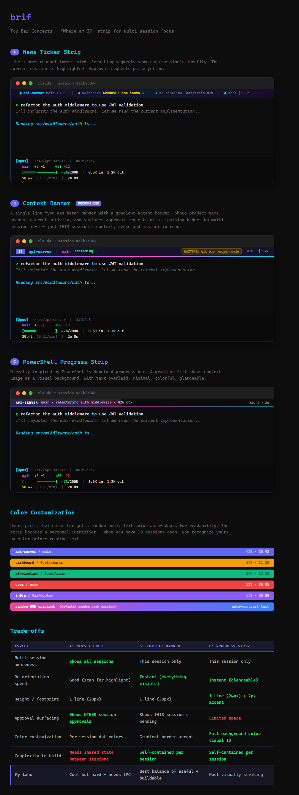
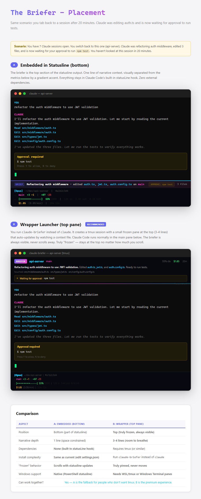

<p align="center">
  <h1 align="center">brif</h1>
  <p align="center">
    <strong>Mission-aware dashboard and statusline for AI coding assistants.</strong>
    <br />
    See your goal, context usage, git status, cost, and more — at a glance.
  </p>
  <p align="center">
    <a href="LICENSE"></a>
    
    
  </p>
</p>

<p align="center">
  
</p>

---

## Features

### Statusline

An always-on metrics bar at the bottom of your terminal. Updated after every assistant response.

| Line | Content |
|------|---------|
| **Model** | Active model name, project path, session ID, agent/worktree badges |
| **Git** | Branch, staged/modified/untracked counts, lines changed |
| **Context** | Progress bar (color-coded) + token breakdown (input / output / cache) |
| **Cost** | Session cost, burn rate, wall-clock duration |
| **Weather** | Country code, conditions, temperature |

The context progress bar shifts color as usage climbs:

- **Green** — under 70%
- **Yellow** — 70-89%
- **Red** — 90%+ (compaction approaching)

A rainbow gradient accent line runs beneath the statusline. Every section is independently toggleable.

### brif pane

An optional tmux-based top pane that shows mission context: current goal, task progress, and blocking status.

<p align="center">
  
</p>

The pane operates in two modes:

- **Active** (expanded) — goal, completed items, remaining tasks, blocking status
- **Ambient** (compact) — 2-line summary with progress bar

It auto-collapses to ambient mode after 10 seconds and re-expands when approval is needed or after extended inactivity.

```
▎ BRIF  api-server/main ctx:55% $1.85
▎ Goal: Add JWT auth to /api/users [====------] 3/5 APPROVE npm test
```

---

## Quick Install

### macOS / Linux

```bash
curl -sL https://raw.githubusercontent.com/balgaly/brif/main/install.sh | bash
```

> Requires [`jq`](https://jqlang.github.io/jq/). Install with `brew install jq` or `apt install jq`.

### Windows (PowerShell)

```powershell
irm https://raw.githubusercontent.com/balgaly/brif/main/install.ps1 | iex
```

### Manual install

1. Download [`statusline.sh`](statusline.sh) (macOS/Linux) or [`statusline.ps1`](statusline.ps1) (Windows).
2. Copy to your assistant's config directory (`~/.claude/` by default).
3. Make executable: `chmod +x ~/.claude/statusline.sh`
4. Add to `settings.json` in the same directory:

```json
{
  "statusLine": {
    "type": "command",
    "command": "~/.claude/statusline.sh"
  }
}
```

On Windows, use:

```json
{
  "statusLine": {
    "type": "command",
    "command": "powershell -NoProfile -File C:/Users/YOUR_USER/.claude/statusline.ps1"
  }
}
```

The statusline appears on the next assistant interaction.

---

## Configuration

Edit the `CONFIGURATION` block at the top of the statusline script. No external config files needed.

### Feature toggles

| Option | Default | Description |
|--------|---------|-------------|
| `CFG_SHOW_GIT` | `true` | Git branch + staged/modified/untracked counts |
| `CFG_SHOW_WEATHER` | `true` | Country code + weather + temperature |
| `CFG_SHOW_TOKENS` | `true` | Input/output/cache token counts |
| `CFG_SHOW_COST` | `true` | Session cost + burn rate + duration |
| `CFG_SHOW_LINES` | `true` | Lines added/removed in session |
| `CFG_SHOW_SESSION` | `true` | Session ID (first 8 chars) |

### Style

| Option | Default | Description |
|--------|---------|-------------|
| `CFG_STYLE` | `"banner"` | `"banner"` (gradient accent line) or `"classic"` (no accent) |
| `CFG_ACCENT_COLOR` | `""` | Hex color for solid accent line. Empty = rainbow gradient. |

### Settings

| Option | Default | Description |
|--------|---------|-------------|
| `CFG_WEATHER_UNIT` | `"C"` | `"C"` for Celsius, `"F"` for Fahrenheit |
| `CFG_CACHE_GIT_SEC` | `5` | Git cache TTL in seconds |
| `CFG_CACHE_WEATHER_SEC` | `1800` | Weather cache TTL in seconds (30 min) |
| `CFG_PREFIX` | `" .  "` | Prefix for continuation lines |
| `CFG_SEPARATOR` | `"  \|  "` | Separator between sections |
| `CFG_BAR_WIDTH` | `15` | Width of the context progress bar |

### Minimal mode

Disable everything except context for a clean two-line output:

```bash
CFG_SHOW_GIT=false
CFG_SHOW_WEATHER=false
CFG_SHOW_TOKENS=false
CFG_SHOW_COST=false
CFG_SHOW_LINES=false
CFG_SHOW_SESSION=false
```

Result:

```
[Opus]  ~/my-project
 .  [======---------]  42%/200K
```

---

## brif pane

### How it works

1. **Hooks** observe assistant events (tool use, prompts) and log them to `~/.claude/brif/<session>/events.jsonl`.
2. **The assistant** updates `~/.claude/brif/<session>/mission.json` with goal, progress, and status.
3. **The statusline** writes metrics (cost, context %) to `~/.claude/brif/<session>/metrics.json`.
4. **The pane renderer** polls these files and renders the dashboard.

To teach the assistant how to update mission state, add the contents of [`claude-md-snippet.md`](claude-md-snippet.md) to your project's `CLAUDE.md`.

### Usage

After installing, launch with:

```bash
brif                          # start a new session
brif --resume <session-id>    # resume an existing session
```

Press **Enter** in the top pane to toggle between active and ambient modes.

### brif pane configuration

Edit the top of `brif-pane.sh`:

| Option | Default | Description |
|--------|---------|-------------|
| `CFG_BRIF_COLOR` | `""` | Override session color (hex). Empty = auto from mission.json. |
| `CFG_POLL_INTERVAL` | `2` | Seconds between pane refreshes |
| `CFG_ACTIVE_TIMEOUT` | `10` | Seconds before auto-collapsing to ambient mode |

---

## How it works

The statusline integrates with Claude Code's `statusLine` command interface. After each assistant message, session data is piped as JSON to stdin. The script parses it, extracts model info, context usage, cost, and git state, then prints formatted ANSI text to stdout for display at the bottom of the terminal.

**Performance:**

- Git info is cached (default 5s) to avoid lag in large repos
- Weather is cached (default 30min) — one API call per half hour
- No API tokens consumed — the statusline runs entirely locally

**External APIs (free, no keys required):**

- [wttr.in](https://wttr.in) — weather data
- [ip-api.com](http://ip-api.com) — geolocation (country code)

---

## Platform notes

| | macOS / Linux | Windows |
|---|---|---|
| **Progress bar** | Unicode block characters | ASCII `=`/`-` (encoding-safe) |
| **Flags/emoji** | Native rendering | Country shown as bold text (`US`, `IL`) |
| **JSON parsing** | `jq` (required) | Built-in PowerShell |
| **brif pane** | tmux (native) | tmux via WSL or Git Bash |

---

## Testing

Test with mock data without a running assistant session:

```bash
echo '{"model":{"display_name":"Opus"},"cwd":"~/project","workspace":{"current_dir":"~/project","project_dir":"~/project"},"context_window":{"used_percentage":42,"context_window_size":200000,"current_usage":{"input_tokens":8500,"output_tokens":1200,"cache_read_input_tokens":2000}},"cost":{"total_cost_usd":0.42,"total_duration_ms":120000,"total_lines_added":50,"total_lines_removed":12},"session_id":"a1b2c3d4e5f6"}' | ./statusline.sh
```

---

## Troubleshooting

| Problem | Solution |
|---------|----------|
| Statusline not showing | Check script is executable (`chmod +x`). Run with mock data to verify. |
| Shows `--` or empty values | Normal before the first response. Fields populate after the first message. |
| Garbled characters on Windows | Ensure you are using `statusline.ps1`, not the Bash version. |
| Weather not showing | Check internet access. Try `curl wttr.in/?format=%t` manually. |
| `jq: command not found` | Install jq: `brew install jq` (macOS) or `apt install jq` (Linux). |
| Slow/laggy updates | Increase `CFG_CACHE_GIT_SEC` for large repos. |
| brif pane blank | Check that `~/.claude/brif/current/mission.json` exists. It is created after the first prompt. |
| `tmux: command not found` | Install tmux: `brew install tmux` (macOS) or `apt install tmux` (Linux). |

---

## License

[MIT](LICENSE)
